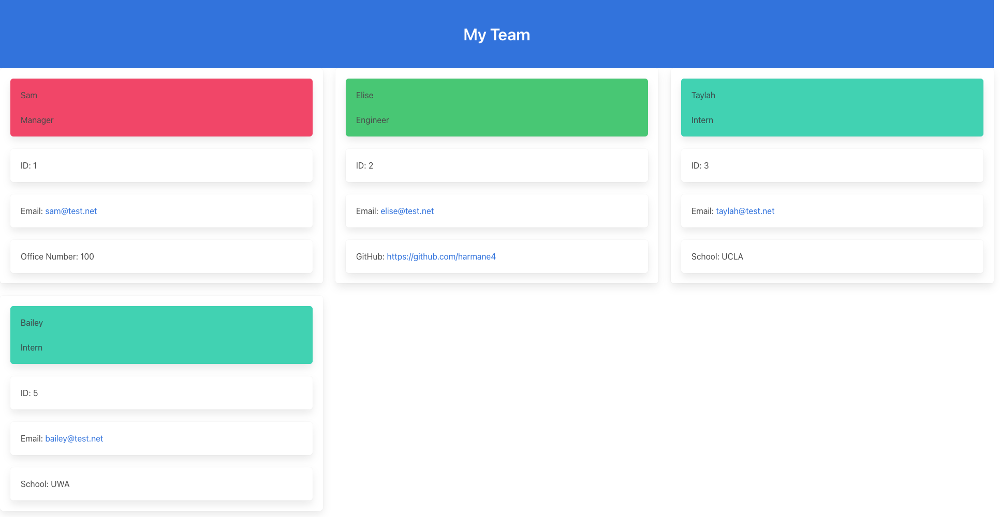

# Sample README
  
  
  ## Description 
  This command-line application takes information about employees on a software engineering team and then generates an HTML webpage that displays summaries for each employee. The HTML webpage is generated by user input using Inquirer. 

  When a user clicks on an email address in the HTML the default email programs opens and populates the To field of the email with the address. 

  When a user clicks on the GibHub username, the GitHub profile opens in a new tab.

  The following technologies were used to create this application
  - Node.JS
  - Inquirer 
  - Jest
  - Bulma

  Preview of an example team:

   
  
  ## Table of Contents 
  
  - [Installation](#installation)
  - [Usage](#usage)
  - [Video Demonstration](#videoDemo)
  - [License](#license)
  - [Tests](#tests)
  - [Resources](#resources)
  - [Questions](#questions)
  
  ## Installation 
  To install the application clone the repository from GitHub. Ensure you have the necessary dependencies of Inquirer and Jest installed. To do so, invoke the command `npm install` in your terminal.

  You must also have Node.JS installed.

  ## Usage 

  To run the application, navigate to the index.js file in the command line and invoke the command `index.js` in your terminal.

  To invoke the tests simple run the command `npm test` in your terminal. 
  

  ## Video Demonstration 
  To view a walk-through of how to use the generator please refer to the [video demonstration](https://youtu.be/qyBaR4EoQuc)
  
  ## License 
  [MIT](https://choosealicense.com/licenses/mit/)

  Copyright (c) 2021 Elise Harman
  
   
  ## Resources

  [Inquirer](https://github.com/SBoudrias/Inquirer.js/blob/master/packages/inquirer/examples/hierarchical.js)
  
  
  ## Questions 
  If you have any questions or would like to report and issue please contact me at my [GitHub]( https://github.com/harmane4) or elise_harman@hotmail.com   
  

